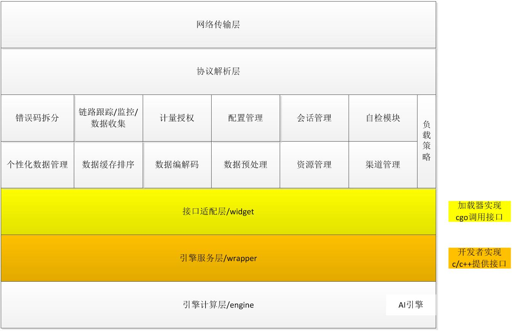
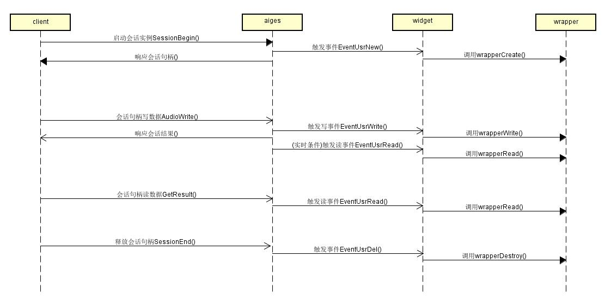

#
开发者手册
 

###简介
* 引擎平台加载器即通过对网络、日志、数据处理、分发策略、业务逻辑等模块的封装，为AI引擎提供的快速上线提供服务的方式。  

&nbsp;&nbsp;
引擎开发者可通过提交内核引擎包及加载器适配wrapper库，将内核以插件形式嵌入引擎平台加载器的方式提供网络服务，使内核引擎开发人员具备网络服务开发的能力。用户通过集成引擎平台加载器，仅需实现引擎本地的计算处理逻辑及必要的业务功能支持，即可通过引擎平台快速实现AI引擎的分布式集群计算，同时开发者不必关注底层的网络传输协议、数据排序逻辑、网络带宽消耗、分布式负载均衡、链路日志跟踪、AI数据收集等网络服务自身需要考虑的其他问题。 

###适用对象
* 内核引擎开发人员
* 引擎服务开发人员
* 其他AI能力提供者

###项目地址
	1. AIGES框架仓库：https://git.xfyun.cn/AIaaS/AIGES.git
	2. wrapper库定义：https://git.xfyun.cn/AIaaS/AIGES/src/master/wrapper

###快速集成
	用户仅需依据头文件实现wrapper库(c/c++)开发,即可实现对引擎平台加载器的集成,通过引擎平台上线发布即可提供在线服务.

	发布流程-线下调试
	1. 获取源码并构建加载器，项目地址：https://git.xfyun.cn/AIaaS/AIGES.git
	2. 依据头文件wrapper.h实现wrapper库及相关接口功能，输出libwrapper.so
	3. 线下进行功能&性能&稳定性测试验证(线下构建及部署说明见:INSTALL.md)
	4. 有效线下调试测试方法及环境
	
	发布流程-上线发布
	1. 引擎平台上传内核引擎组件包，内核引擎资源及引擎wrapper库
	2. 引擎平台选择适当加载器稳定版本基础镜像
	3. 引擎平台配置引擎服务相关配置对
	4. 推送版本发布服务

	启动命令
	-m 配置模式
	-c 加载器配置文件
	-u 配置中心地址
	-p 项目名
	-g 集群名
	-s 服务名

###功能特性
* 支持注册自定义事件回调
2.	支持多类集群负载分发策略  
3.	支持会话模式/非会话模式  
4.	支持用户自定义配置扩展
5.	支持服务个性化数据管理
6.	支持链路trace日志追踪&性能监控
7.	支持AI能力数据收集
8.	支持渠道权限管理控制
9.	支持计量授权管理控制
11.	支持多类数据编解码
12.	支持音频数据重采样
14.	支持多数据流输入&输出
15.	支持无缝优雅更新
16.	支持服务框架模块插拔  
   

###功能参数
* 数据编解码参数
	1. 输入编码
	2. 输出编码

###接口介绍
**AIGES：**加载器通过注册回调事件的方式进行集成，当加载器触发具体事件时，调用用户通过Register接口注册的对应回调接口

	// 框架初始化接口
	// @param srvVer	引擎服务版本号；用于拉取配置中心配置
	func (srv *EngService) Init(srvVer string) (errInfo error)
	
	// 框架事件注册接口
	// @param event		引擎框架触发事件
	//					当前框架支持事件：EventUsrInit|EventUsrFini
						EventUsrNew|EventUsrDel|EventUsrExcp|EventUsrDebug
						EventUsrResLoad|EventUsrResUnload|EventUsrResUpdate
						EventUsrRead|EventUsrWrite
	// @param action	注册事件对应的用户回调行为;
	func (srv *EngService) Register(event usrEvent, action interface{}) (errInfo error)

	// 框架运行接口
	func (srv *EngService) Run() (errInfo error)

	// 框架逆初始化接口
	func (srv *EngService) Fini()

	// 框架版本号
	// @return	版本号
	func (srv *EngService) Version() string

**widget：**封装wrapper相关c接口及注册回调事件，并提供Go2C及C2Go的数据转换，内置控件widgetInner注册了如下事件：  
	* 初始化&逆初始化  
	* 实例申请&实例释放  
	* 数据读事件&数据写事件  
	* 个性化加载&个性化释放  
	* 异常事件&调试事件    
 
	// 控件初始化
	// @param clib		控件加载调用的引擎c库,即wrapper.so
	func (inst *WidgetInner) Open(clib string) (errInfo error)
	
	// 控件逆初始化
	func (inst *WidgetInner) Close() 

	// 事件注册及行为封装,其中涉及对srv.Register的调用
	// @param srv	服务框架运行实例	
	func (inst *WidgetInner) Register(srv *service.EngService) (errInfo error)

	// 引擎服务版本号
	// @return	版本号
	func (inst *WidgetInner) Version() (ver string)

**wrapper：**通过c/c++库实现引擎服务的逻辑处理，以插件形式提供c接口供加载器控件层widget加载调用. eg:  
	* 框架触发引擎初始化事件-> widget调用wrapper.wrapperInit  
	* 框架触发新请求接入事件-> widget调用wrapper.wrapperCreate  
	* 框架触发请求写数据事件-> widget调用wrapper.wrapperWrite  
	
	部分示例接口如下, 详细接口定义见:
	https://git.xfyun.cn/AIaaS/AIGES/src/master/src/cgo/header/widget/wrapper.h
	
	int WrapperAPI wrapperInit(pConfig cfg)

	int WrapperAPI wrapperFini()

	const char* WrapperAPI wrapperError(int errNum)

	const char* WrapperAPI wrapperVersion()
	
	const char* WrapperAPI wrapperCreate(pParamList params, wrapperCallback cb, unsigned int psrIds[], int psrCnt, int* errNum)

	int WrapperAPI wrapperWrite(const char* handle, pDataList reqData)

	int WrapperAPI wrapperRead(const char* handle, pDataList* respData)

	int WrapperAPI wrapperDestroy(const char* handle)
	
	int WrapperAPI wrapperExec(pParamList params, pDataList reqData, pDataList* respData)

  
*若引擎服务不关注相关事件，可作为空实现处理，但需暴露接口符号*

**框架调用流程**  

	var aisrv service.EngService
	var widgetInst widget.WidgetInner
	// 控件初始化&逆初始化
	errInfo := widgetInst.Open(wrapperDll)
	if errInfo != nil {
		fmt.Println(errInfo.Error())
		return
	}
	defer widgetInst.Close()

	// 框架初始化&逆初始化
	errInfo = aisrv.Init(widgetInst.Version())
	if errInfo != nil {
		fmt.Println(errInfo.Error())
		return
	}
	defer aisrv.Fini()

	// 注册行为
	errInfo = widgetInst.Register(&aisrv)
	if errInfo != nil {
		fmt.Println(errInfo.Error())
		return
	}

	// 框架运行
	errInfo = aisrv.Run()
	if errInfo != nil {
		fmt.Println(errInfo.Error())
		return
	}

**环境说明**

	加载器构建及运行镜像：Ubuntu14.04, go1.9.2
	utils模块需依赖linux numa库相关环境
	codec模块需依赖相关c/c++库: /aiges/src/cgo/library/libaudioCoding.so  
	dp模块需依赖相关c/c++库: /aiges/src/cgo/library/libspeexdsp.so  
	相关编解码库目录: /aiges/src/cgo/library
	wrapper接口定义: /aiges/src/master/src/cgo/header/widget/wrapper.h

**配置说明**  

	1. 框架配置：加载器服务框架配置,离线调试可用.
	[aisrv] // section名即服务名;  
	finder = 0					# 服务发现功能;缺省关闭  
	port = 5090					# 服务监听端口;缺省随机端口  
	
	[aiges]  
	libCodec = "libamr.so;libamr_wb.so;libspeex.so;libico.so"	# 音频编解码库;  
	gesMock = 0					# Mock功能;缺省为0  
	sessMode = 1				# 服务模式;缺省会话模式;  
	numaNode = 0				# cpu亲和性;缺省不设置;  
	realTimeRlt = 1				# 实时响应;缺省开启;  
	usrCfg	= "demo.toml"		# 用户配置;缺省为空;  

	[elog]  
	elogRemote = 0				# 远端eventlog;缺省关闭  
	elogLocal = 0				# 本地eventlog;缺省关闭  
	elogConsumer = 2
	elogHost = "127.0.0.1"  
	elogPort = "4545"  
	elogSpill = "/log/server/spill"  
	elogS3ak = ""  
	elogS3sk = ""  
	elogS3ep = ""  
	elogZkhost = ""  
	
	2. xsf框架配置：底层框架配置,离线调试可用.
	[log] 						# 本地日志,离线调试开启.
	level = "debug"				# 日志级别: "error","warn","info","debug"
	file = "./log/aiges.log"
	size = 3
	count = 3
	die = 3
	async = 0					# 是否异步模式,缺省开启：1.
	
	[lb]    					# xrpc loadReporter
	able = 0					# v1版本lb, 缺省关闭：0.
	#离线调试,其他配置项无需关注

	[lbv2]
	able = 0					#v2版本lb
	#离线调试,其他配置项无需关注

	[trace]
	able = 0
	#离线调试,其他配置项无需关注
	
	[fc]						# xrpc flowControl
	able = 1
	router = "sessionManager"   # 路由字段，可选项为sessionManager和qpsLimiter
	max = 100					# 会话模式时代表最大的授权量，非会话模式代表间隔时间里的最大请求数
	ttl = 10000					# 会话模式代表会话的超时时间，非会话模式代表有效期（间隔时间）
	best = 100					# 最佳授权数
	strategy = 2				# 0.代表定时上报(v1)；1.根据授权范围上报(v1)；2.基于hermes(v2)；缺省：0.
	roll = 5000

	3. wrapper配置：kv(用户自定义)通过wrapper.wrapperInit传递至引擎服务层.
	[wrapper] 					# 用户自定义配置项仅支持字符串类型
	"common.lic" = "100"		# 若配置会话授权,需与fc.max/fc.best配置项同步.
	"resource./msp/resource/sms/acmod_16KPowerFlt_sms_RNN.bin" = "HMM_16K"
	"resource./msp/resource/sms/wfst.bin" = "WFST"
	

###集成样例
	1. git clone https://git.xfyun.cn/AIaaS/AIGES.git
	2. cd AIGES & buildDebug.sh 生成output目录，输出加载器及依赖组件.
	3. cd AIGES/wrapper 获取服务层头文件wrapper.h，实现输出libwrapper.so
	   参考Exsample: https://git.xfyun.cn/AIaaS/AIGES/src/master/test/wrapper  
	4. cd AIGES/test/script 获取加载器离线调试配置文件及启动脚本: aiges.toml，start.sh
	5. 修改引擎服务自定义配置项([wrapper] 配置段)，若会话模式：同步修复fc.max & fc.best
	6. 使用start.sh启动服务.
	7. 测试工具暂需独立开发, 可联系技术支持.

###支持
	邮箱: zsli@iflytek.com
	微信: 1126544836
	电话: 15656957584

###其他参考文档(TODO)
1. 引擎平台使用说明  
2. 现网trace日志流查询  
3. 现网AI能力数据提取
4. 现网调试方法     
