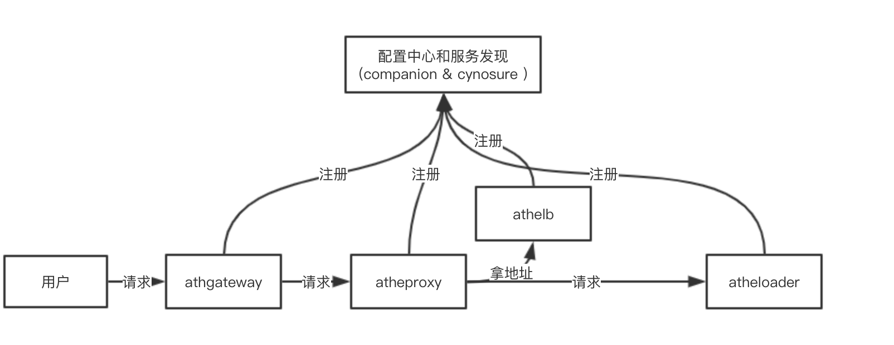

# AthenaServing [](https://travis-ci.com/xfyun/AthenaServing)[](https://golang.org/)[License](https://img.shields.io/badge/License-Apache%202.0-blue.svg)](https://github.com/xfyun/AthenaServing/blob/master/LICENSE)


 是一个高性能，方便的AI 模型部署和服务框架。它提供了多种api 用于适配各种AI场景。它集成了服务发现，配置中心等功能，方便用户训练模型的快速部署与上线。

## 主要功能
 - 配置中心 
 - 服务发现
 - 版本管理
 - websocket 接入
 - 参数转换
 - 授权均衡
 
## 快速体验
```
// 部署配置中心和服务发现
docker run -it --rm littlescw00/companion:latest sh watchdog.sh -h${本地ip} -p9639 -z${zk地址} -w${网页ip}
docker run -it --rm littlescw00/cynosure:latest sh watchdog.sh

// 录入相关配置

// 部署服务
docker run -it --rm littlescw00/athelb -m 1 -p project -g group -s athelb -u ${companion url}
docker run -it --rm littlescw00/athegateway  -m 1 -p project -g group -s athegateway -u ${companion url}
docker run -it --rm littlescw00/atheproxy  -m 1 -p project -g group -s atheproxy -u ${companion url}
```
## 组件介绍
#### AtheGateway
   - 全新的Web API服务webgate提供了基于配置的热插拔AI能力特性,只需要通过新增或编辑配置、推送配置两部操作即可完成AI能力的上线或者下线，免去了以往的定制开发工作，业务人员可以把更多的精力投入到AI能力协议的设计和实现上。 
   - [文档](AtheGateway/doc/README.md) 
#### AtheProxy
   - AtheProxy接收来自webgate接入层的请求，并根据请求的路由参数，请求负载均衡模块lb，获取引擎地址，将请求发送到引擎，并从引擎获取结果。
   - [文档](AtheProxy/README.md) 
#### AtheLB
   - 全局负载，基于收集的信息做负载，并按特定策略返回相应的节点 
   - [文档](/AtheLB/readme.md) 
#### AtheLoader
   - AI引擎加载器是通过对网络、日志、数据处理、分发策略、业务逻辑等模块进行统一封装，为AI引擎模型快速上线提供服务的方案。用户通过实现加载器既定插件接口，即可完成AI引擎及模型的快速服务化。
目前支持文本，音频，图像，视频等数据的交互处理。
   - [文档](AtheLoader/docs/README.md) 
   
## 整体链路

## 编译方法
```
 # 编译所有组件
./build.sh
```

### 编译参数
|参数|功能|
| --- | --- |
|AtheGateway| 编译AtheGateway|
|AtheProxy| 编译AtheProxy|
|AtheLB|编译AtheLB|
|AtheLoader|编译AtheLoader|
