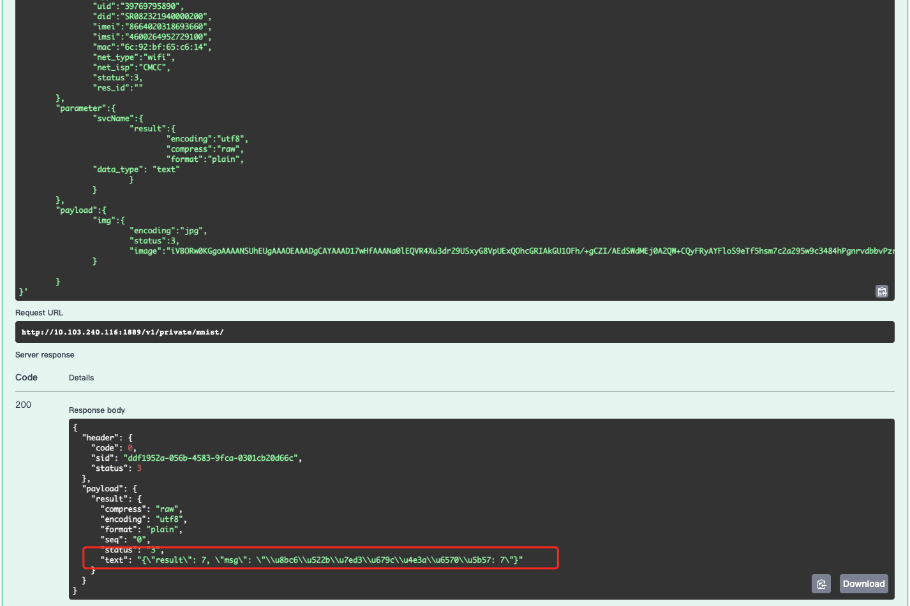

# AI Service Engine

<!-- markdownlint-disable MD033 -->

<span class="badge-placeholder">[](https://img.shields.io/github/forks/xfyun/aiges)</span>
<span class="badge-placeholder">[](https://img.shields.io/github/stars/xfyun/aiges)</span>
<span class="badge-placeholder">[](https://github.com/xfyun/aiges/actions/workflows/build.yaml)</span>
<span class="badge-placeholder">[](https://github.com/xfyun/aiges/releases/latest)</span>
<span class="badge-placeholder">[](https://github.com/xfyun/AthenaServing/graphs/contributors)</span>
<span class="badge-placeholder">[](https://github.com/iflytek/aiges/blob/master/LICENSE)</span>


<!-- markdownlint-restore -->

## 官方文档

[👉👉👉点击进入](https://iflytek.github.io/athena_website/)

## 背景

> AIGES是 Athena Serving Framework中的核心组件，它是一个个专为AI能力开发者打造的AI算法模型、引擎的通用封装工具。
> 您可以通过集成AIGES，快速部署AI算法模型、引擎，并托管于Athena Serving Framework，即可使用网络、分发策略、数据处理等配套辅助系统。
> Athena Serving Framework 致力于加速AI算法模型、引擎云服务化，并借助云原生架构，为云服务的稳定提供多重保障。
> 您无需关注底层基础设施及服务化相关的开发、治理和运维，即可高效、安全地对模型、引擎进行部署、升级、扩缩、运营和监控。

## 上新！！！

[👉👉👉快速了解 Cgo模式GRPC模式区别](https://iflytek.github.io/athena_website/docs/current/%E5%8A%A0%E8%BD%BD%E5%99%A8/Python%E6%8F%92%E4%BB%B6#python%E5%8A%A0%E8%BD%BD%E5%99%A8%E6%8F%92%E4%BB%B6%E6%96%87%E6%A1%A3)

## 整体架构


## 使用工作流(AthenaServing)


#### 特性

&#9745; 支持模型推理成RPC服务(Serving框架会转成HTTP服务)

&#9745; 支持C代码推理

&#9745; 支持Python代码推理

&#9745; 支持once(非流式)推理、流式推理

&#9745; 支持配置中心，服务发现

&#9745; 支持负载均衡配置

&#9745; 支持HTTP/GRPC服务

&#9745; Cgo模式/GRPC模式切换 [go 和 python通信方式]

#### SDK

[👉👉👉Python](https://github.com/xfyun/aiges_python)

#### AI协议

参见: [👉👉👉ase-proto](https://github.com/xfyun/ase_protocol)


## 准备环境

python 版本请选用 3.9+ [也可以下载我们的docker镜像](https://github.com/iflytek/aiges/releases/tag/v3.0-alpha11)

如下流程可在容器环境中进行 (无需gpu):

```bash
docker run -itd --name mnist2 -p 1889:1888 public.ecr.aws/iflytek-open/aiges-gpu:10.1-1.17-3.9.13-ubuntu1804-v3.0-alpha11 bash
```

您也可以自己准备环境， 直接下载二进制在您自己的任何环境上运行aiges.


### 0. 装sdk
``` pip3 install aiges==0.5.0  -i https://pypi.python.org/simple```


### 1. 下载加载器


1. ```wget https://github.com/iflytek/aiges/releases/download/v3.0-alpha11/aiges_3.0-alpha11_linux_amd64.tar.gz```


## 初始化 python wrapper 项目

通过aiges创建一个名为mnist的项目

```bash
python3 -m aiges create -n mnist
```

### 2. 初始项目结构

```bash
root# tree mnist/
mnist/
├── Dockerfile
├── README.md
├── requirements.txt
└── wrapper
    ├── test_data
    │   └── test.png
    └── wrapper.py
```

### 3. 解压加载器 [docker提供的镜像默认有AIservice，您可以用下述命令更新最新的AIservice binary]

```tar zxvf aiges_3.0-alpha11_linux_amd64.tar.gz -C mnist ```

首次执行:

```bash
root@505a3a0e670c:/home/aiges# ./AIservice
加载器运行方法:

- 本地模式运行
1: ./AIservice -init  , 初始化配置文件 aiges.toml (若存在，则不会替换)
2: ./AIservice -m=0 , 仅用于本地模式运行
3: ./AIservice -mnist , 下载mnistdemo
- 配置中心模式 (开源计划删除)
- 更多参数选项: 请执行 ./AIservice -h
```

此时项目结构如下

```bash
➜  mnist git:(master) ✗ tree -L 3 .
.
├── AIservice
├── Dockerfile
├── include
│   ├── type.h
│   └── wrapper.h
├── library
│   ├── libahsc.so
│   ├── libIce.so.34
│   └── libIceUtil.so.34
├── README.md
├── requirements.txt
└── wrapper
    ├── test_data
    │   └── test.png
    └── wrapper.py

4 directories, 11 files
```

### 4. 配置PythonGrpc模式 初始化aiges 配置

顺序执行如下:

*  ``` export AIGES_PLUGIN_MODE=python```
*  ```./AIservice -init```  【会在当前目录下生成一个 aiges.toml】

* ```./AIservice -m 0 -c aiges.toml  -s svcName ```

启动引擎，此时结果如下:【注意svcName必须和aiges 的section对应,当前默认就是 svcName】

```bash
root@012d31456c50:/home/aiges/mnist# ./AIservice -m 0 -c aiges.toml  -s svcName
2022/11/15 18:22:01 widgetpy.go:26: Starting Using Python :
config.toml version:
2022/11/15 18:22:01 utils.NewLocalLog success. -> LOGLEVEL:debug, FILENAME:./log/aiges.log, MAXSIZE:3, MAXBACKUPS:3, MAXAGE:3
2022/11/15 18:22:01 host2ip->ip:0.0.0.0,port:5090
2022/11/15 18:22:01 finderSwitch:0,finderSwitchErr:<nil>
2022/11/15 18:22:01 about to deal with hermes.
2022/11/15 18:22:02 NewSessionManager success.
2022/11/15 18:22:02 NewSidGenerator success.
2022/11/15 18:22:02 fn:AbleTrace,able:false
2022/11/15 18:22:02 about to deal finder.
2022/11/15 18:22:02 about to deal metrics.
2022/11/15 18:22:02 metrics is disable
2022/11/15 18:22:02 about to deal rateLimiter.
2022/11/15 18:22:02 about to deal vCpuManager.
2022/11/15 18:22:02 about to deal bvtVerifier.
2022/11/15 18:22:02 namespace not set, use default
2022/11/15 18:22:02 bvt is disable
header pass list: []
2022-11-15T18:22:02.476+0800 [WARN]  python-plugin: plugin configured with a nil SecureConfig
2022-11-15T18:22:02.477+0800 [DEBUG] python-plugin: starting plugin: path=/bin/sh args=[sh, -c, "/usr/bin/env python -m aiges.serve"]
2022-11-15T18:22:02.478+0800 [DEBUG] python-plugin: plugin started: path=/bin/sh pid=126
2022-11-15T18:22:02.478+0800 [DEBUG] python-plugin: waiting for RPC address: path=/bin/sh
2022-11-15T18:22:02.653+0800 [DEBUG] python-plugin: using plugin: version=1
2022-11-15T18:22:02.655+0800 [DEBUG] python-plugin.stdio: received EOF, stopping recv loop: err="rpc error: code = Unimplemented desc = Method not found!"
2022-11-15T18:22:02.656+0800 [DEBUG] python-plugin.sh:  root:wrapperInit:107 - INFO:  Importing module from wrapper.py: wrapper
2022-11-15T18:22:02.657+0800 [DEBUG] python-plugin.sh:  root:wrapperInit:119 - ERROR:  module 'wrapper' has no attribute 'Wrapper'
2022/11/15 18:22:02 grpc.go:20: Call WrapperInit Failed...ret: 30001
```

这是因为我们的 wrapper还未准备好

#### 5. 编写推理逻辑wrapper，以mnist项目为例

下载 mnist demo:

* ``` ./AIservice -mnist```

默认会下载 ` https://github.com/iflytek/aiges_demo.git` 项目,并解压到当前目录 `aiges_demo`

如果此命令长时间没有反应，可能是因为GFW问题， 可手动下载 ```https://github.com/iflytek/aiges_demo/archive/refs/tags/v1.0.0.zip```

unzip 解压到当 aiges_demo目录中即可【注意手动解压可能嵌套了一层 aiges_demo_1.0.0目录】。


删除 当前mnist下默认生成的wrapper目录，替换上述的demo

* ``` rm -r wrapper```
* ``` cp -ra aiges_demo/mnist/wrapper/  ./ ```
* ``` cp -ra aiges_demo/mnist/requirements.txt mnist/```
* ``` pip install -r requirements.txt```
* ``` export AIGES_PLUGIN_MODE=python```
* ``` export PYTHONPATH=/home/aiges/mnist/wrapper```
* ``` 再次运行引擎  ./AIservice -m 0 -c aiges.toml  -s svcName```

标准输出如下:

```bash
2022/11/15 21:26:29 widgetpy.go:26: Starting Using Python :
config.toml version:
2022/11/15 21:26:29 utils.NewLocalLog success. -> LOGLEVEL:debug, FILENAME:./log/aiges.log, MAXSIZE:3, MAXBACKUPS:3, MAXAGE:3
2022/11/15 21:26:29 host2ip->ip:0.0.0.0,port:5090
2022/11/15 21:26:29 finderSwitch:0,finderSwitchErr:<nil>
2022/11/15 21:26:29 about to deal with hermes.
2022/11/15 21:26:30 NewSessionManager success.
2022/11/15 21:26:30 NewSidGenerator success.
2022/11/15 21:26:30 fn:AbleTrace,able:false
2022/11/15 21:26:30 about to deal finder.
2022/11/15 21:26:30 about to deal metrics.
2022/11/15 21:26:30 metrics is disable
2022/11/15 21:26:30 about to deal rateLimiter.
2022/11/15 21:26:30 about to deal vCpuManager.
2022/11/15 21:26:30 about to deal bvtVerifier.
2022/11/15 21:26:30 namespace not set, use default
2022/11/15 21:26:30 bvt is disable
header pass list: []
[GIN-debug] [WARNING] Creating an Engine instance with the Logger and Recovery middleware already attached.

[GIN-debug] [WARNING] Running in "debug" mode. Switch to "release" mode in production.
 - using env:	export GIN_MODE=release
 - using code:	gin.SetMode(gin.ReleaseMode)

[GIN-debug] GET    /v1/svcName               --> github.com/xfyun/aiges/httproto.(*Server).ginHandler.func1 (3 handlers)
[GIN-debug] POST   /v1/svcName               --> github.com/xfyun/aiges/httproto.(*Server).ginHandler.func1 (3 handlers)
[GIN-debug] PUT    /v1/svcName               --> github.com/xfyun/aiges/httproto.(*Server).ginHandler.func1 (3 handlers)
[GIN-debug] PATCH  /v1/svcName               --> github.com/xfyun/aiges/httproto.(*Server).ginHandler.func1 (3 handlers)
[GIN-debug] HEAD   /v1/svcName               --> github.com/xfyun/aiges/httproto.(*Server).ginHandler.func1 (3 handlers)
2022-11-15T21:26:30.116+0800 [WARN]  python-plugin: plugin configured with a nil SecureConfig
2022-11-15T21:26:30.116+0800 [DEBUG] python-plugin: starting plugin: path=/bin/sh args=[sh, -c, "/usr/bin/env python -m aiges.serve"]
[GIN-debug] OPTIONS /v1/svcName               --> github.com/xfyun/aiges/httproto.(*Server).ginHandler.func1 (3 handlers)
[GIN-debug] DELETE /v1/svcName               --> github.com/xfyun/aiges/httproto.(*Server).ginHandler.func1 (3 handlers)
[GIN-debug] CONNECT /v1/svcName               --> github.com/xfyun/aiges/httproto.(*Server).ginHandler.func1 (3 handlers)
[GIN-debug] TRACE  /v1/svcName               --> github.com/xfyun/aiges/httproto.(*Server).ginHandler.func1 (3 handlers)
[GIN-debug] GET    /test.json                --> github.com/xfyun/aiges/httproto.getDemo (3 handlers)
2022-11-15T21:26:30.116+0800 [DEBUG] python-plugin: plugin started: path=/bin/sh pid=1081
2022-11-15T21:26:30.116+0800 [DEBUG] python-plugin: waiting for RPC address: path=/bin/sh
[GIN-debug] GET    /swagger/*any             --> github.com/swaggo/gin-swagger.CustomWrapHandler.func1 (3 handlers)
2022-11-15T21:26:30.242+0800 [DEBUG] python-plugin: using plugin: version=1
2022-11-15T21:26:30.244+0800 [DEBUG] python-plugin.stdio: received EOF, stopping recv loop: err="rpc error: code = Unimplemented desc = Method not found!"
2022-11-15T21:26:30.245+0800 [DEBUG] python-plugin.sh:  root:wrapperInit:107 - INFO:  Importing module from wrapper.py: wrapper
2022-11-15T21:26:31.642+0800 [DEBUG] python-plugin.sh:  root:_check_path:151 - WARNING:  <class 'FileNotFoundError'>
2022-11-15T21:26:31.643+0800 [DEBUG] python-plugin.sh:  root:wrapperInit:112 - INFO:  User Wrapper newed Success.. starting call user init functions...
2022-11-15T21:26:31.643+0800 [DEBUG] python-plugin.sh:  root:wrapperInit:85 - INFO:  Initializing ...
2022-11-15T21:26:31.666+0800 [DEBUG] python-plugin.sh:  root:wrapperSchema:141 - INFO:  Entering warpperSchema ...
2022-11-15T21:26:31.672+0800 [DEBUG] python-plugin.sh:  root:test_value:233 - WARNING:  test_data/0.png not exist.. check
2022-11-15T21:26:31.672+0800 [DEBUG] python-plugin.sh:  root:schema:434 - INFO:  Genrating Schema...
aiService.Init: init success!
2022/11/15 21:26:31 about to x.run
2022/11/15 21:26:31 about init interceptor
2022/11/15 21:26:31 success init interceptor
2022/11/15 21:26:31 about to call grpc.NewServer(opts...),maxRecv:4194304,maxSend:4194304
2022/11/15 21:26:31 about to call utils.RegisterXsfCallServer(x.grpcserver, srv)
2022/11/15 21:26:31 about to call reflection.Register(x.grpcserver)
2022/11/15 21:26:31 about to exec userCallback
2022/11/15 21:26:31 deal with UserHighPriority
2022/11/15 21:26:31 deal with UserNormalPriority
2022/11/15 21:26:31 deal with UserLowPriority
2022/11/15 21:26:31 about to call x.grpcserver.Serve
2022/11/15 21:26:31 about to check if the grpc service([::]:5090) is started
2022/11/15 21:26:31 grpc server([::]:5090) started successfully
2022/11/15 21:26:31 bvtVerifierInst is disable,ignore...
2022/11/15 21:26:31 about to call finderadapter.Register([::]:5090)
2022/11/15 21:26:31 about to exec fcDelayInst
2022/11/15 21:26:31 about to call fc delay task
2022/11/15 21:26:31 blocking for grpcserver.Serve
```

默认监听 http端口是: 1888,  可从aiges.toml文件中看到

### 5. Postman调试

* api地址: http://youIP:1888/v1/svcName [具体地址可以访问 http://youIP:1888 swagger进行查看]

* post方式请求: body 部分

```json
 {
	"header":{
		"appid":"123456",
		"uid":"39769795890",
		"did":"SR082321940000200",
		"imei":"8664020318693660",
		"imsi":"4600264952729100",
		"mac":"6c:92:bf:65:c6:14",
		"net_type":"wifi",
		"net_isp":"CMCC",
		"status":3,
		"res_id":""
	},
	"parameter":{
		"svcName":{
			"result":{
				"encoding":"utf8",
				"compress":"raw",
				"format":"plain",
                "data_type": "text"
			}
		}
	},
	"payload":{
		"img":{
			"encoding":"jpg",
			"status":3,
			"image":"iVBORw0KGgoAAAANSUhEUgAAAOEAAADgCAYAAAD17wHfAAANa0lEQVR4Xu3dr29USxyG8VpUExQOhcGRIAkGU1OFh/+gCZI/AEdSWdMEj0A2QW+CQyFRyAYFloS9eTf5hsm7c2a295w9c3484hPgnrvdbbvPzrYzc87J5eXl9uLiYvvmzRsAI3r9+vV2s9lsTxTgyckJgAZubm62JyrSDwAYx+fPn4kQaGkX4ePHj/cOABgHIyHQGBECjREh0BgRAo0RIdAYEQKNESHQGBECjREh0BgRAo0RIdAYEQKNESHQGBECjREh0BgRAo0RIdAYEQKNESHQGBECjREh0BgRAo0RIdAYEQKNESHQGBECjREh0BgRAo0RIdAYEQKNESHQGBECjREh0BgRAo0RIdAYEQKNESHQGBECjREh0NguwsePH+8dADAORkKgMSIEGiNCoDEiBBojQqAxIgQaI0KgMSIEGiNCoDEiBBojQqCxRUT49OnT7YsXL7KeP3++1ed3fX29vbq6ynr37l3V27dvs3Ts/Px8++TJk05am/vw4cNOp6ene58T1mMRESq2ly9fdrq8vNxuNpvdJ5vz8ePH7YcPHzpFwGnI6X97/fr19tmzZ7vgcxTio0ePOt2/f3/vc8J6LD5CjVKK0MP7PxHmpBHmECFqiHCACF+9erUXX4oIUUKEA0TISIg+iHCACEsjIRGihgiJEI0tIkI92c/OzrIUqKYRbm5uOik0j8sp5BwdU+yaavC4iAyHWESEGsm+ffuW9fXr1+3t7e32z58/29+/fx/Fr1+/tj9//uyk+//x40cnTZ/4C8Na6AmodxNd9AKpF1PNtfr8a/Dnw9wsIkJ9M/2JnVIkf//+bab2AqAXiy9fvqySXiT1Itrl06dPu3caik2LMnL8+TA3i4/w+/fvk4hQjyFn7RGKh0eEM0SE8+bhEeEMEeG8eXhEOENEOG8eHhHOEBHOm4dHhDOkCEvTAHqiexhjSiOMKY30T0WoaYoSf+Km/P+dE49QUxIeok9R+HSFPx/mZhERXlxc7O3/S2lC3b+xqdJkvGi+ym+T0hfRn1wpjcZ6keji84opharbl9Q+xrHFO44u/v+n9Pn518O/Nu/fv9/tCc3Rns579+7tPSfmZBER6tXQ9/AFrabR2xmF2kVL29LbxGbgoGVpfpuUQvWlbimFWBqpNVL66Jkq3XaMkV6Pr0SheDzhkM+vRi90CtFfHGPFEhFOgH4u8B31KUXkr6ApRerL3VLaJeG3CYpQTwQPL6W3XKWQahGVbnvI7fvy6FyMhl2Ps2+E+hoqwhyFSIQTQITl2/fl0bk0QkeEdUR4QISl2xPhvwgdER6GCA+IkJFwP7xchOnox0h4OCIkwiqPzqUjob8VFSIsW0SEsZ/Q4wuKyE9VmFKkur1+Syr+99Lt9bWrTWFop4D/aj7lTzpX+u2j+P8/Nr0I+OeU6hth/HY0ogv6N78dnQhtmn3w4EGn0oZb0XG/zV1un67m0AtC+meM0ulu/5RCL420MVLHi0JO7fZ9+ZSM04uYf15Bn7vmCn2lUMqjcwpO9+OPS5gnxMFKT5SY5/RTY8TpMWo780vzpEPwZWJOL1L6/HL0+LQiSLH5CHnoOwGNeHqh8fhD6Ws7B0Q4Aj1JFFKOzr5d+5lWo7H+vxx97Nrt+/IXBhen8MjR50+EZUQ4AiIkwpJdhFoQ6wcwHCIkwhJGwhEQIRGWEOEIiJAIS4hwBGNEWJon7ct/W+oUoT+uoM9fEXp4d4kwpihy9NwlQlTpSVJSm4eM2LrUbt+XPn6JXgQUYy5Y/b4hVs108RVAKUWqUVAjrn/s4F/vuSFC9KYQfJI+nayvrerRiqJUeuJmTfRrlNf9+IuPxGg7Z0SI3vpGGNHlRIQKzt/Kpz93zhkRordjR6ileUQIFBw7QkZCoIII+yFC9EaE/RAheot5ypirTP+uY5pq8PBKEcapEvV33ZafCbF6/qT3ALTzXcH4VEOobeqNzdEh/h0bp2Nts09PBH+8c0OEqFJsvtE56LjOgF5allaL0Dcpp/SWNu5nqYgQVYdEqNj8tBuhFqH/HOmIEKtHhMdFhKgiwuMiQlQR4XERIaqI8LiIEFU+JeDTA8eOUNul/DEtCRGiSiFoT1/QeUZFf9exmAvUSYDvShH6/sCUJvyXMCFfQoSo0oS5X3g16JhWt/joloo5xDjZb/p3xavJ+JIl7BksIUJU6fnh8d01wi61CHViYyLE6h07wrgOfQ4RAifHj9DDc0SI1WsZISMhcHL8CHk7SoSo0Pk9/bqMQc+dWoQ+LeFTFBGh/swhQiyezi3qT/yg1Sq60rA218ZmWxcxddGFPD3eoNHU9yi6JewZLCFC7GLTxLif3j5OcR874/XWMcejcxpJdR/aZe90H/541oYIsQvE4/MIPTzn4XmESz6Ddl9ECCJsjAjRNEKtDfXHszZEiN4RenSOCMuIEL0jrIVIhGVEiN0cnf/WMmgvXy1Cj87p+UWE3YgQu32BPn+XTsbXLuSpucLNZpOlvYYKbckn7+2LCLF7u+jL0dJlabUIdeJfPZFyFKJGPL9P/EOE2I2EHt8xIvRTYyzlDNp9ESGIsLFdhPrB3A9gPYiwLUZCEGFjRAgibIwIMViEPj0h2gZFhGVEuAL+pPcALi8v90awEJc98wn6dKL+48ePu2mOHD23tOrGHxP+IcIV8PA8wtpFPrVp1+NLI3z//n1x1Q0T8mVEuAIe3l0jrI2EGklL60+JsIwIV8DDu2uEh4yERPj/EeEKeHhDR1gaCfVLGSIsI8IV8PDGjJCRsI4IV8DDI8JpIUJsr6+v98ILmuc7JMI4c5rj7WgdEa6AJuP1Pc7RXJ5GQQXlJ+aN+BSjT8Knk/H6GLof3ycYYsRFHhGugL6/vhImXRFTO4O2YtOkfY6eQLpgqN8nDkeEKxARpjvm038TYVtEuAK5CNMQibAtIlyBrggZCaeBCFeACKeNCFeACKeNCFegdH1BHatFqGkIPVFyFKimQPw+cTgiXABtI/JJ8qBjCkVzgV20adfnB9N5Qi3Qjr2BTiHrfvwx4XBEuACK4Pz8PEvHbm9v90a3lGLzy1inl7PWSNd1JV2tlNGFRP0x4XBEuACHRuhLzsIhEXYtSxOdKt8fEw5HhAtAhPNGhAtAhPNGhAtAhPNGhAtAhPNGhAug31L6df+Cfqup6wvWIuyi45qeIMLjIcIZOD097aTjV1dXuwl13+sXFJNPS6Q0VxirX5xur+sL6r40FZHDfsF+iHAGFIBvlA06/unTp91ol6PVMBrNPLyUAtYpLnQS3xyNgv6YMBwinIFDI1RwOX0i1McmwuMiwhkgwmUjwhkgwmUjwhkgwmUjwhkgwmUjwgVQLH0j9PjSCDUX6PeJ4RDhDGhXvOYCdZJdp71+mucrrXrRfsEuOq6T/2pVjF9bMHB9weMiwhnQN6l0mnqF5KNbqjRK6pi+/5pw90l40WoYJuOPiwhnQN8kDy89TX3fCLU7XsFpxMshwuMiwhkgwmXbRagFwH4A00GEy8ZIOANEuGxEOANEuGxEOAPaZhTB5WiqwcNLaVOvYsvRMSJsiwgnIKYCcnRcI1ZpHrA2Ga85RoXmZ+GOy6Npv6BC872KgQiPiwgnQLH56BN0vHbe0Bp9fxXa2dnZHp0CI+4HbRDhBIwRYQTnXr58SYSNEeEEtI5Q56Hxx4TxEOEEtI6QkbAtIpwAIlw3IpwAIlw3IpyBvhFqOiKCy+FnwraIcATaAR/zfk7HtXm2tFWpNg+oyXzN92lvodOeQ60NLu3OZx6wLSIcQS1CRVRa1VKLUBGXLuLJ281pI8IRHBKhh0eE60GEIyBClBDhCIgQJUQ4AiJECRGOgAhRQoQjiMuK+dSA6HjfqyopwgguhwinjQhHoNUqfi7PoPN9xlygX6AzeHRO+wW1VclXwwS9APhjwnQQ4Qi0KkUT57GJNqWRSqOdh3UX+tga7TQp73QK+7iYKKaJCEegCD2+oSPU0jMFl0OE00aEIyBClBDhCIgQJUQ4AiJECRGOgAhRQoQjiAh9/i4Q4boR4QBKAeiYrv9X2qp0yFxgCRHOGxEOQPNxz58/39FVbdM/dUwrWkqT8bUVMTVEOG9EOICIUOG5WoSHnEG7hgjnjQgHQITogwgHQITogwgHQITogwgHcNcIFV76JxGuGxEOQAF4fEHHFGFEF9J/E+G6EeEAtGdP+wJzXr16tfsiKxbFluNROV0EVPOMOYo4Nu4qRKeRmAinjQgHoNh8FUzQ11ZX0/Ww7iJ22OfomO5Hp8pQdBFjGiUn9502IhxALcLNZrMX1l3cJcIcIpw2IhwAEaKPXYT6ucEP4HBTijD3syERThsj4QCIEH0Q4QCIEH0Q4QCOHWFpG5SOpRHmMEUxbUQ4gL4RKiQf4dKRTh9DG4M155ijn+k12ik2FycYxnQR4QD6RqjQ/MKgQRcP1ZI4v08sBxEO4NgR6uzaGun8FPqBn/nmjQgHQITogwgHQITogwgHQITogwgHQITogwgHUIpQarsoFKFiy9E0BREuGxEOQJt3dQ3CHAWkr6+uIdildGJg0SoYhVbijwnzQYRAY0QINEaEQGNECDRGhEBjRAg0RoRAY4rwP1Ov0CXSgGK4AAAAAElFTkSuQmCC"
		}
		
	}
}
```

返回响应
```bash
{
    "header": {
        "code": 0,
        "sid": "0d9115af-0c6b-4526-a539-05b3c8aa9cfa",
        "status": 3
    },
    "payload": {
        "result": {
            "compress": "raw",
            "encoding": "utf8",
            "format": "plain",
            "seq": "0",
            "status": "3",
            "text":"{\"result\": 7, \"msg\": \"\识\别\结\果\为\数\字: 7\"}"
        }
    }
}
```

### 6. swagger调试mnist

当前默认集成了 swagger2.0 for openapi3.0.

启动后访问:

```http://<yourip>:1888```

如下图:


Try it out ! 可以复制上述 postman部分的 body进行请求。



可以看到识别结果返回

*  至此，单独的aiges加载器完成基本运行


由于alpha 是裁剪后，并刚刚合并了 http接口部分，很多功能还不完善，但是基本可以托管能力


目前已知问题:

* python进程退出未做处理，需要跟随父进程自动退出

* 部分运行异常暂时没时间处理


## 联系我们

* focus on:

[](https://github.com/iflytek)

* contact:


**注意备注来源: 开源** 


