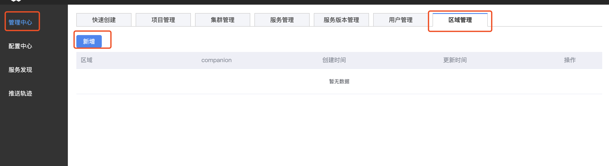
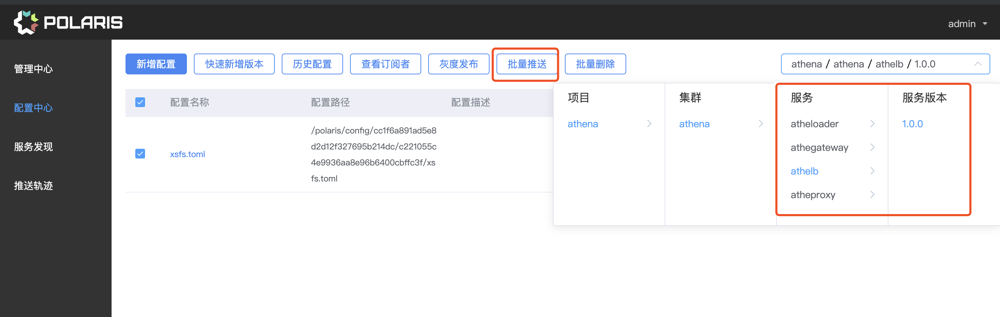

# 部署说明
 * [服务发现和配置中心部署部署服务发现](#服务发现和配置中心部署)
   * [依赖](#依赖)
   * [部署页面](#部署页面)
   * [添加区域](#添加区域)
   * [推送配置](#推送配置)

服务发现和配置中心部署
========

依赖
-----
  - mysql
  - zookeeper

部署页面
--------

```
./run_cynosure.sh listen_port mysql_host mysql_addr mysql_username mysql_password
#./tools/run_cynosure.sh 8011 127.0.0.1 3306 test password
./run_companion.sh -h local_ip -p listen_port -z zk_ip -w cynosure_ip:cynosure_port 
#./run_companion.sh -h 127.0.0.1 -p 11223 -z 127.0.0.1:2181 -w 127.0.0.1:8011
```
通过访问http://127.0.0.1:8011 即可访问配置中心页面

添加区域
-------



在弹出的框中填入
```
区域名称: local
companion: http://${companion_url}:${companion_port}

# 其中companion:是之前启动componion监听ip 和host
```

推送配置
------



将每一个服务的配置推送到对应componion

