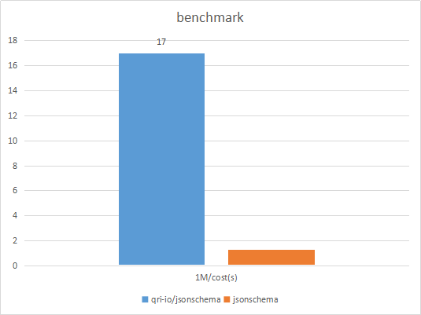

## jsonschema golang 实现的高性能jsonschema

## Features
- 支持自定义校验器。
- 支持从go 结构体生成 jsonschema
- 校验器运行时0内存分配
- 支持动态改变json 中的值，能够设置默认值
- 支持json 解析。并设置默认值

## benchmark with github.com/qri-io/jsonschema



## Usage

```go
	schema := `
{
	"type":"object",
	"properties":{
		"name":{
			"type":"string|number",
			"maxLength":5,
			"minLength":1,
			"maximum":10,
			"minimum":1,
			"enum":["1","2"],
			"replaceKey":"name2",
			"formatVal":"string",
			"format":"phone"
		}
	}
}
`
	rootSchema := jsonschema.Schema{}

	err := json.Unmarshal([]byte(schema), &rootSchema)
	if err != nil {
		panic(err)
	}

	js := `
{
	"name":"1"
}
`
	var o interface{}
	err = json.Unmarshal([]byte(js), &o)
	if err != nil {
		panic(err)
	}
	fmt.Println(rootSchema.Validate(o))


```


## 支持校验器字段。

#### type  限定字段类型

取值范围：string  number bool object array integer
```json
{
  "type": "string"
}
```
或者
```json
{
  "type": "string|number"
}
```

#### properties
当值为object 时起作用。限定object 中字段的模式，不允许出现properties 中未定义的字段,如果需要允许未定义字段，
可以新增 additionalProperties:true

```json
 {
  "type": "object",
  "properties": {
    "name": {
        "type": "string"
    }
  },
  "additionalProperties": true
}
```

#### maxLength

当字段为string 或者array 类型时起作用，限定string的最大长度。（字节数）或者数组的最大长度

#### minLength

当字段为string 或者array 类型时起作用，限定string的最小长度。（字节数）或者数组的最小长度

#### maximum

当字段为数字类型时字作用，限定数字的最大值

#### minimum

当字段为数字类型时起作用，限定数字的最小值

#### enum

该值类型为数组。限定值的枚举范围

````json
{
  "enum": ["1","2","3"]
}
````

#### required

该值类型为字符串数组，限定必须存在数组中声明的字段

````json
{
  "required": ["username","password"]
}
````

#### pattern

当字段的值为字符串是起作用，pattern 的值是一个正则表达式，会校验字段是否和该正则匹配

````json
{
  "type": "string",
  "pattern": "^\\d+$"
}
````

#### multipleOf

字段的值为数字时起作用，值必须为 multipleOf 的整倍数

````json
{
  "type": "number",
  "multipleOf": 5
}
````

#### items

当字段的值为数组时起作用，用于校验数组中的每一个实体是否满足该items 中定义的模式

```json
{
  "type": "array",
  "items": {
      "type": "object",
      "properties":{
        "username": {
            "type": "string"
        }
      }
  }
}
```

#### switch
当switch中的key的值等于case 中的值时，执行case中对应的校验器。如果都不满足，则执行default中的校验器
```json

{
  "switch": "name",
   "case": {
      "name1": {
        "required": ["age1"]
      } ,
      "name2": {
        "required": ["age2"]
      }

   },
   "default": {
      "required": ["key3"]
   }
}

```

#### if

 当if 中的校验器没有任何错误时，执行then中的校验器，否则执行else中的校验器。 if中的错误不会抛出
 ```json
{
  "if": {"required": "key1"},
  "then":{"required": "key2"},
  "else": {"required": "key3"}
}
 ```

#### dependencies

当传了某个值时，必须传某些值

```json
{
  "dependencies": {
      "key1": ["key2","key3"]
}
}
```

#### not

not 中的校验器不满足时，会通过。否则不通过

```json
{
  "not": {
      "type": "string"
  }
}
```

### allOf

allOf 中的校验器全部通过才算通过
```json
{
  "allOf": [
    {
        "type": "string"
    },{
        "maxLength": 50
}
  ]
}
```

### allOf

anyOf 中的校验器任意一个通过就算通过
```json
{
  "anyOf": [
    {
        "type": "string"
    },{
        "maxLength": 50
}
  ]
}
```

#### constVal

参数转换校验器： 参数字段会被 constVal 中的值替代

```json
{
    "type": "object",
    "properties": {
         "name":{
              "type": "string",
              "constVal": "alen"
          }
    }
}
```

#### defaultVal

参数转换校验器： 参数字段没有时 会添加该字段，值为defaultVal

```json
{
    "type": "object",
    "properties": {
         "name":{
              "type": "string",
              "defaultVal": "alen"
          }
    }
}
```

#### replaceKey

参数转换校验器： 会复制参数，名重命名为 replaceKey 指定的key

```json
{
    "type": "object",
    "properties": {
         "name":{
              "type": "string",
              "replaceKey": "alen"
          }
    }
}
```

#### 其他校验器，参考jsonschema 官方文档


### 自定义校验器：

1. 实现Validator 接口
2. 实现接口创建函数 NewValidatorFunc
3. 调用函数： RegisterValidator(name string, fun NewValidatorFunc)

````go
type Validator interface {
	Validate(c *ValidateCtx, value interface{})
}

type NewValidatorFunc func(i interface{}, path string, parent Validator) (Validator, error)


````

### 从结构体生成schema
```
type User struct {
    Name   string   `json:"name" maxLength:"15" pattern:"^[0-9a-zA-Z_\\-.]+$"`
    Age    int      `json:"age" maximum:"150" minimum:"1" multipleOf:"2"`
    Childs []string `json:"childs"`
}

sc, err := GenerateSchema(&User{})
if err != nil {
    panic(err)
}

fmt.Println(string(sc.Bytes()))
```

生成的schema

````json
{
    "properties": {
        "age": {
            "maximum": 150,
            "minimum": 1,
            "multipleOf": 2,
            "type": "integer"
        },
        "childs": {
            "items": {
                "type": "string"
            },
            "type": "array"
        },
        "name": {
            "maxLength": 15,
            "pattern": "^[0-9a-zA-Z_\\-.]+$",
            "type": "string"
            }
        },
    "type": "object"
}

````
